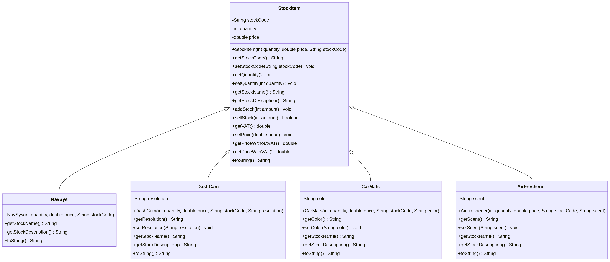

# UFCFC3-30-1 Introduction to OO Systems Development
## Project Portfolio – Test Cases and UML Diagrams

---

## UML Class Diagram

The diagram below shows all classes and their inheritance relationships.

**Inheritance hierarchy:**
- `StockItem` is the base (parent) class.
- `NavSys`, `DashCam`, `CarMats`, and `AirFreshener` all extend `StockItem`.

---

## Step 1 UML (StockItem only)

Before adding subclasses, the initial UML only contained the `StockItem` class with its attributes and methods as described in Step 1 of the specification.

---

## Step 2 UML (StockItem + NavSys)

After Step 2, the `NavSys` class was added, inheriting from `StockItem` using an inheritance arrow. `NavSys` overrides `getStockName()`, `getStockDescription()`, and `toString()`.

---

## Step 3 UML (All Classes)

Three more subclasses were added: `DashCam`, `CarMats`, and `AirFreshener`. All inherit from `StockItem` and override the name, description, and `toString()` methods. Each also has its own private attribute (e.g., `resolution`, `color`, `scent`).

---

## Test Cases

| Test Case ID | Type | Purpose | Input | Expected Result |
|---|---|---|---|---|
| TC01 | Class Test | Create a StockItem with valid values | qty=10, price=99.99, code="W101" | Object created; toString shows correct values |
| TC02 | Class Test | addStock with valid amount | addStock(10) on item with qty=10 | qty becomes 20 |
| TC03 | Class Test | addStock with 0 (invalid) | addStock(0) | Error message printed; qty unchanged |
| TC04 | Class Test | addStock exceeding 100 | addStock(95) on item with qty=10 | Error message printed; qty unchanged |
| TC05 | Class Test | sellStock with valid amount | sellStock(2) on item with qty=10 | qty becomes 8; returns true |
| TC06 | Class Test | sellStock more than in stock | sellStock(50) on item with qty=10 | Returns false; qty unchanged |
| TC07 | Class Test | sellStock with 0 (invalid) | sellStock(0) | Error message printed; returns false |
| TC08 | Class Test | setPrice and getPriceWithVAT | setPrice(100.99) | getPriceWithVAT() returns 118.66324999999999 |
| TC09 | Class Test | getVAT returns correct rate | getVAT() | Returns 17.5 |
| TC10 | Class Test | NavSys overrides getStockName | new NavSys(10, 99.99, "NS101") | getStockName() returns "Navigation system" |
| TC11 | Class Test | NavSys overrides getStockDescription | new NavSys(10, 99.99, "NS101") | getStockDescription() returns "Geo Vision Sat Nav" |
| TC12 | GUI Test | Create new StockItem via GUI | Enter type=StockItem, code=W101, qty=10, price=99.99 and click Create Item | Item appears in dropdown; display area shows stock info |
| TC13 | GUI Test | Add stock via GUI | Select item, enter 10 in add qty field, click Add Stock | Display area shows updated qty |
| TC14 | GUI Test | Sell stock via GUI | Select item, enter 2 in sell qty field, click Sell Stock | Display area shows reduced qty |
| TC15 | GUI Test | Change price via GUI | Select item, enter 100.99 in new price field, click Change Price | Display area shows new price with and without VAT |

---

## Notes

- All test cases were run manually using the GUI and the `TestNavSys` console class.
- Error messages are printed to the console (System.out) when invalid inputs are given.
- The GUI uses a dropdown to select which stock item to manage, making it easy to test multiple items.
